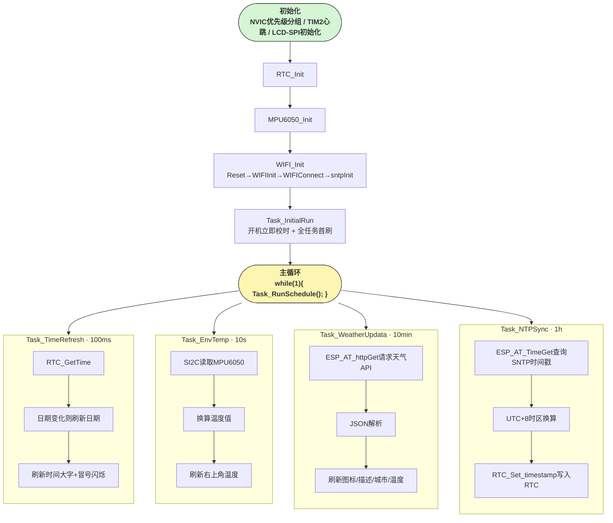

# STM32 WiFi 智能桌面时钟

基于 **STM32F103** + **ST7735S TFT屏** + **MPU6050** + **ESP32 (WiFi)** 的桌面智能时钟。裸机实现，未使用 RTOS，采用自研的**时间片轮询任务调度器**。

## 功能简介

- ⏰ **实时时钟显示**：STM32 硬件 RTC（LSE 32.768kHz 晶振供电），断电不丢时间
- 🌐 **NTP 自动校时**：通过 ESP32 AT 指令联网获取 SNTP 时间，自动换算东八区（UTC+8）写入 RTC
- 🌡️ **环境温度显示**：MPU6050 内置温度传感器，软件模拟 I2C 读取
- ☀️ **实时天气显示**：ESP32 联网请求心知天气 API，解析 JSON 并显示城市、天气图标、描述、温度（城市名硬编码中文"合肥"，天气描述为英文）
- 🖼️ **中英文混合显示**：TFT 屏支持 ASCII 与 UTF-8 中文混合绘制
- 🚀 **开机即完整显示**：开机先校时+刷新一次全部任务，不必等待各任务自身周期

## 硬件组成

| 硬件 | 说明 |
|---|---|
| STM32F103 | 主控 MCU |
| ST7735S | 128×128 TFT 彩屏，SPI 接口，硬件 DMA 支持 |
| MPU6050 | 六轴传感器（本项目仅用其内置温度计），软件模拟 I2C |
| ESP32-C3 | WiFi 模块，官方 esp-at 固件，USART 通信 |
| RTC | STM32 内置 RTC，LSE 外部晶振驱动 |

## 软件架构

项目**未使用 RTOS**，而是在 `Task.c` 中实现了一个轻量级**协作式时间片轮询调度器**：每个任务带独立执行周期 `cycle_ms`，由 `TIM2`（`Timer.c`，1ms 一次中断）驱动的系统心跳 `GetSysTick()` 提供时间基准，`main()` 的 `while(1)` 循环里反复调用 `Task_RunSchedule()`，逐一比对每个任务距上次执行的时间差，到期则执行。

### 任务列表

| 任务函数 | 周期 | 功能 |
|---|---|---|
| `Task_TimeRefresh` | 100ms | 读取 RTC，刷新左上角日期与底部大字时间（含冒号闪烁） |
| `Task_EnvTemp` | 10s | 读取 MPU6050 温度并刷新右上角显示 |
| `Task_WeatherUpdata` | 10min | 请求心知天气 API，解析并刷新天气图标/描述/城市/温度 |
| `Task_NTPSync` | 1h | 通过 ESP32 SNTP 获取 UTC 时间戳，+8h 换算后写入 RTC |

### 模块文件说明

| 文件 | 作用 |
|---|---|
| `main.c` | 硬件初始化顺序控制、开机首刷（`Task_InitialRun`）、主循环入口 |
| `Task.c` | 调度器核心 + 四个任务的具体实现 |
| `Timer.c` | TIM2 系统心跳（1ms 中断），提供 `GetSysTick()` |
| `RTC.c` | RTC 驱动，手写日历⇄时间戳换算（不依赖 `<time.h>`，避免裸机环境阻塞） |
| `ST7735S.c` / `BSP_ST7735S.c` | TFT 屏驱动（SPI），批量像素写入，支持 ASCII/中文混合绘制 |
| `MPU6050.c` / `SI2C.c` | MPU6050 驱动 + 软件模拟 I2C |
| `ESP_AT.c` / `ESP_USART.c` | ESP32 AT 指令封装 + USART 底层收发（中断接收） |
| `Weather.c` | 天气数据获取（HTTP GET + JSON 解析）与 UI 绘制 |
| `ST7735_FONT.c/h` | ASCII 字模（8×16 / 16×32）+ 中文字模表 |

## 系统流程图

> 说明：本项目为裸机协作式调度，不涉及 RTOS 的信号量 / 事件组机制；四个任务在同一线程内按周期顺序执行，互不抢占。

## 已知限制

- `Task_WeatherUpdata` / `Task_NTPSync` 内部的 AT 指令调用为阻塞等待（有超时保护，非死等），执行期间会短暂占用主循环
- 天气描述当前仅支持英文（`language=en`），城市名固定硬编码为中文"合肥"
- 若更换城市或需要中文天气描述，需相应扩充 `CH16X16` 中文字模表并调整 `Weather.c` 解析逻辑
